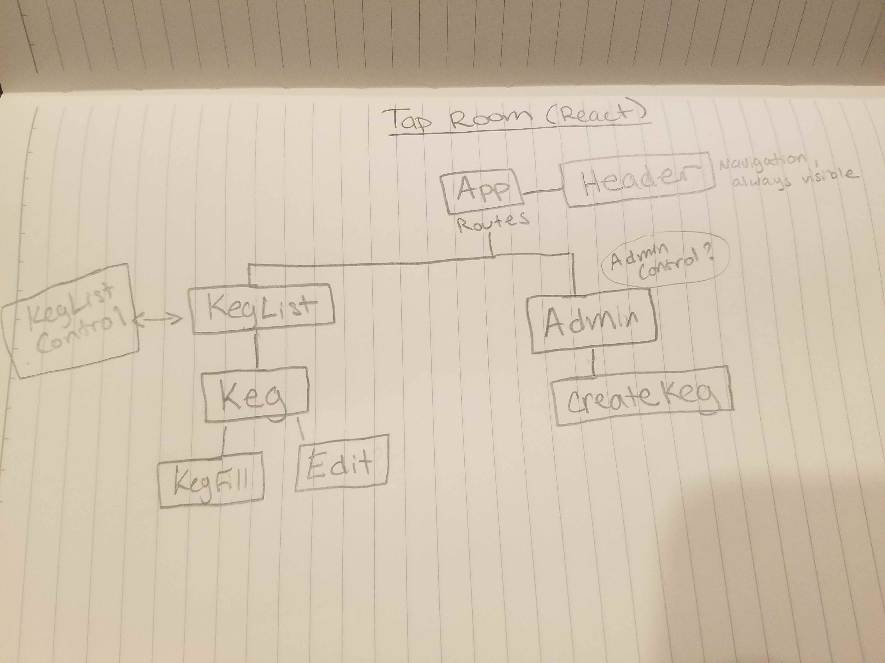

# Tap Room in React

#### React Tap Room project for Epicodus

_Published_ **April 19 2019** 
_Authors_  **Kim McConnell**

1. [Description](#description)
1. [Learning Objective](#learning-objective)
1. [Target Audience/Users](#target-audience/users)
1. [User Stories](#user-stories)
1. [Product Requirements](#product-requirements)
1. [Non-technical Requirements](#non-technical-requirements)
1. [Component Map](#component-map)
1. [Development Specs](#development-specs)
1. [Stretch Goals](#stretch-goals)
1. [Installation](#installation)
1. [Known Bugs](#known-bugs)
1. [Technologies Used](#technologies-used)
1. [License](#license)

### Description
An app that shows the state of a taproom of kegs, with features to add, remove, and edit. Built in React. 

### Learning Objective
Use React to build out the UI (Week 1) and use state with class componets to build interactive features (Week 2)

### Target Audience/Users
* The buisness selling the contents of the kegs for tracking, and the customer so that they may see what is available at any given time. 

### User Stories
**As a** customer, 
**I want** to easily see what drinks are avialale to me, along with ABV, price, and type 
**So that** I can make the right decision for my budget.

**As an** employee 
**I want** to be able to see how much is left in a keg, remove when empty, and add another full keg 
**So that** I can make my buisness more efficient.

### Product Requirements
* Display all avialable kegs
* Display the amount left in each keg
* Display price, ABV, type

### Non-technical Requirements
* Make it look good

### Component Map
#### First Draft of Component map 

### Development Specs
Specification | Input | Output
------------- | ----- | ------
 |  | 

### Stretch Goals (for week 1)
* Add state to change volume left in keg and display that value
* Edit kegs

### Installation
* Clone from https://github.com/kimmcconnell/tap-room-react.git
* Run `$ npm install`

### Known Bugs
* None identified yet

### Technologies Used
* HTML
* Webpack
* React
* CSS

### License
[MIT](./LICENSE.txt)

Copyright (c) 2019 Kim McConnell